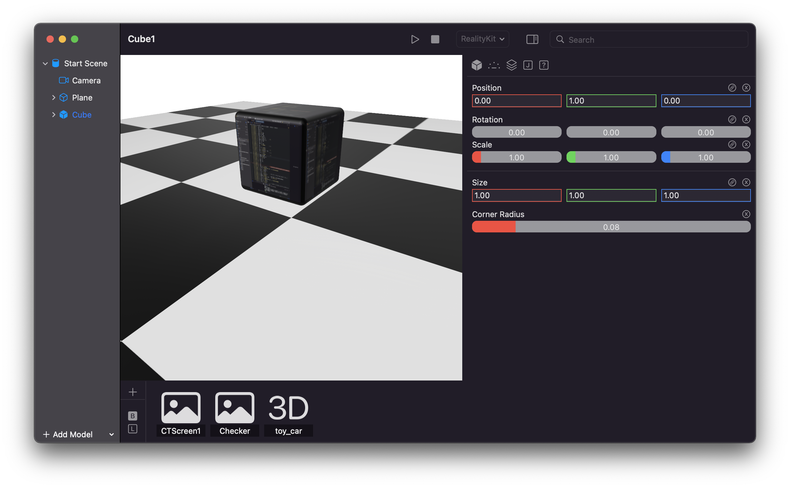
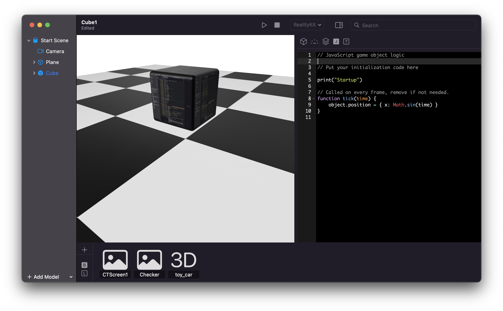

# Carthage

Carthage will be a light weight casual game engine for the Apple Ecosystem. It is based on the lastest Swift / SwiftUI and acts as an abstraction layer to SceneKit and RealityKit. Meaning that you can switch your projects between these two as needed and on the fly.

Carthage uses JavaScript to script your games. JavaScript is fast, tightly integrated into the Swift ecosystem and is probably the most well known scripting language around. I might add a visual scripting language later.

Carthage is currently in the proof of concept phase.

## Abstract

I wanted to create some casual games but the major game engines were too heavy for me to get involved in. SceneKit and RealityKit look good to me, each with their own advantages (SceneKit being available for watchOS / Apple TV and RealityKit being more modern). However as I wanted to create my games live with an overall scripting system and be able to switch between SceneKit and RealityKit an abstraction layer looked like the best solution to me, thus Carthage.

## How it works

Carthage implements an abstraction layer for a virtual scene on top of SceneKit and RealityKit.

Imported models get added to your private iCloud folder so that you have access to your files on any device. Models or textures can than be accessed from objects in the scene via their name. Once we have a player application all referenced assets will be exported into a folder which you can use in the player app to run your game (once it exists).

JavaScript for scripting game logic is already integrated but not yet worked out much, JSON will be used for object and scene data, also already done.

## Status

Currently you can import models, create procedural objects and display them via PBR. Textures can be associated with every PBR property.

The implementation for SceneKit and RealityKit is roughly on the same level, Iam currently working on abstracting the physics engines which is a bigger piece of work.

